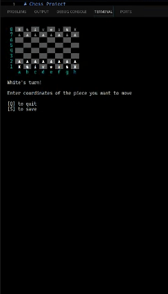

# Chess Project

# Demo

# About
This Chess project was created based on The Odin Project's Ruby Final Project(https://www.theodinproject.com/lessons/ruby-ruby-final-project).

# Instructions
- Select either to play against the CPU, another player, or to play a saved game.
- To move pieces enter the location of piece you wish to move i.e [a2]. The piece will highlight and show the potential squares to move to. Now type in the location you would like to move to. [a4] 
- You may quit or save at anytime by entering Q(q) or S(s)

# Features
- Object oriented design.
- AI random move generator
- Includes Castling and En-Passant
- Ability to save games
- Rspec tested